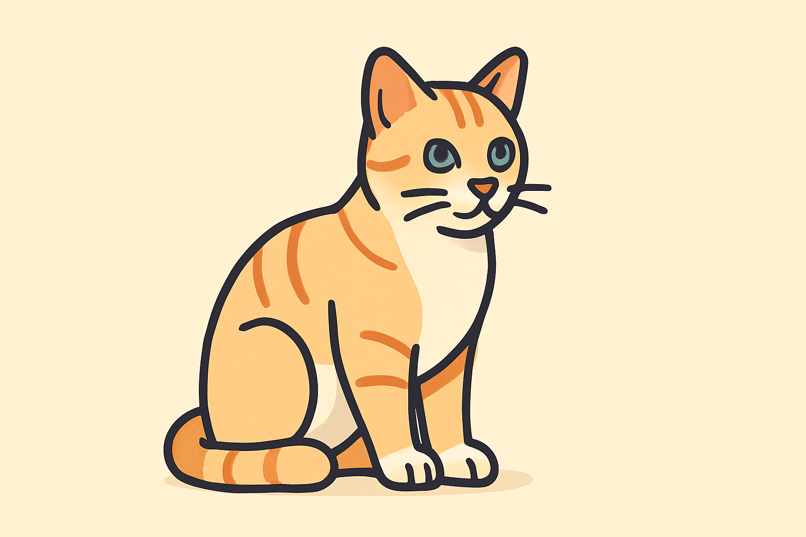
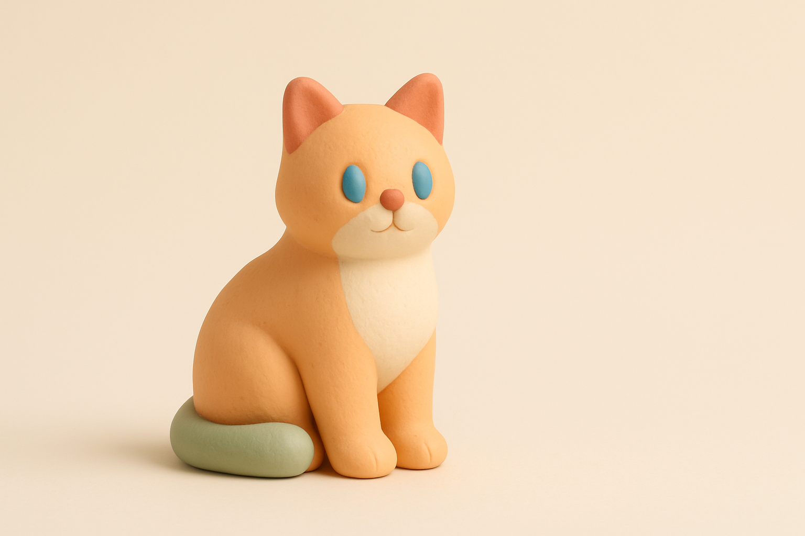
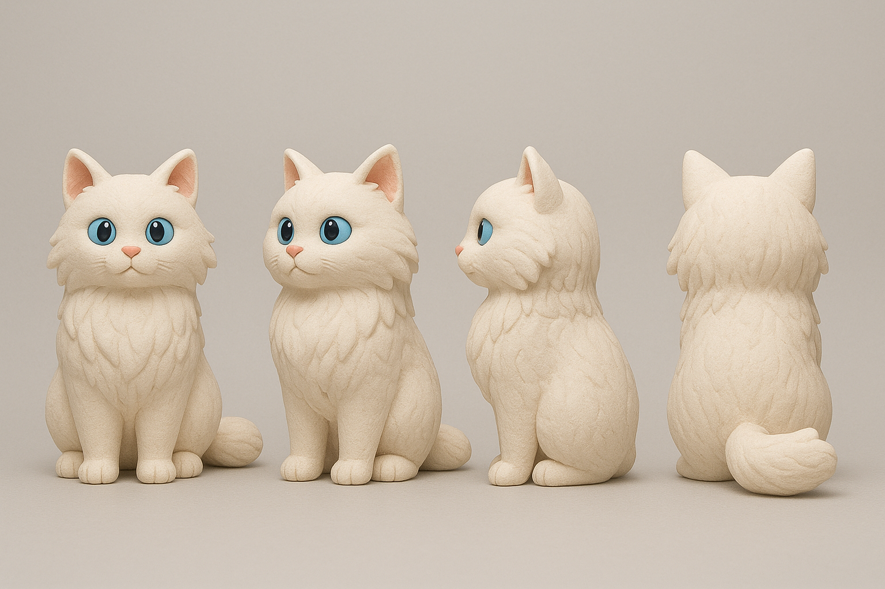

# 이미지 스타일 가이드 — 일관성 설정

> 스타일은 딱 두 가지만 기억하면 된다: **어디서 설정하나 = `STYLE.txt`**, **어떻게 쓰나 = 이 문서.**
>
> 영상 한 편의 이미지 50~90장이 **같은 그림체·팔레트·무드**로 보이게 하는 설정. 기본값은 3Blue1Brown식 도식이고, `STYLE.txt`가 없으면 그 기본 문장이 자동으로 생성된다. **누구나 자기만의 느낌으로 바꿀 수 있다.**

## 1. 일관성은 어떻게 만들어지나

핵심은 **"Style:" 접미사 하나**다. 각 컷의 이미지 프롬프트는 그 컷의 **피사체/구도만** 쓰고(예: "a single house cat, three-quarter pose"), 그 뒤에 **영상 전체가 공유하는 Style 문장**이 자동으로 붙는다. 이 한 문장이 모든 컷의 팔레트·라인·질감·무드를 묶어 통일감을 만든다.

```
[컷별 프롬프트: 피사체만]  +  [Style: ... 영상 공통]   →  일관된 한 컷
        (콘티/VISUALS.json)        (STYLE.txt)
```

- **컷별 프롬프트엔 스타일을 쓰지 않는다** — 피사체·구도·도식만. 스타일은 한 곳에서만 관리.
- **이미지 안에 글자 금지** — 텍스트는 별도 `❝` 카드(CARDS.json)로. (스타일을 바꿔도 이 규칙은 유지 권장)

## 2. 내 스타일로 바꾸기 — 3단계

1. 아래 **4축 템플릿**으로 나만의 `Style:` 문장을 영어로 작성한다.
2. 그 문장을 프로젝트 폴더의 **`STYLE.txt`** 에 저장한다 (CONTI.md 옆. `generated_project/STYLE.txt` 도 인식).
3. 프로젝트 폴더에서 **`weft images`** (또는 picker의 `+ 생성`)로 다시 생성하면 **모든 컷이 새 스타일**로 나온다.

> 코드가 `STYLE.txt`를 읽어 모든 생성 프롬프트에 붙인다(`load_style`). 파일이 없으면 기본 3b1b 스타일을 `STYLE.txt`로 생성한 뒤 그 문장을 쓴다. → **코드 수정 없이 파일 하나로 영상 룩 전체를 바꾼다.**

## 3. 4축 템플릿 (이걸 채우면 Style 문장이 나온다)

| 축 | 정할 것 | 예 |
|---|---|---|
| **그림체/렌더** | 평면 벡터 / 손그림 수채 / 점토 3D / 종이 콜라주 / 도면 … + 라인·질감 | "soft 3D clay, rounded matte forms" |
| **팔레트·무드** | 배경색 + 악센트 3~5색(이름 명시) + 분위기 | "cream background, dusty pastel accents, calm" |
| **인물** | 없음(개념·사물) / 양식화된 실루엣 허용 | "no human figures" |
| **도식 vs 은유** | 정확한 도식 위주 / 은유 위주 / 반반 | "schematic + metaphor balanced" |
| **추가 규칙(고정값)** | 조명·그림자·심도·질감 + **"no text"** + **16:9** | "fixed soft 3-point lighting; no text; 16:9" |

빈 템플릿:
```
Style: <그림체/렌더 + 라인·질감>; <배경색> background with <악센트 색들> accents, <무드> mood; <도식/은유 비중>; <인물 규칙>; <조명·그림자·심도 등 고정값>, consistent across the whole series; 16:9; no text, letters, or numbers inside the generated image.
```
> 팁: **색 이름을 구체적으로**(soft apricot, sage mint…), **고정값은 매 컷 동일하게**(조명·배경) 써야 50~90장이 흔들리지 않는다.

---

## 4. 예시 A — 기본값: 3Blue1Brown식 깔끔한 도식 (현재)



```
Style: clean diagrammatic explainer illustration with precise educational-diagram clarity (3Blue1Brown-like structure); warm light palette — soft cream / off-white background with warm amber, terracotta, and muted teal accents; smooth vector shapes, consistent thin-to-medium line weight, generous negative space; balanced mix of accurate schematic diagrams and conceptual metaphor imagery; no human figures (concepts, objects, and metaphors only); soft ambient shading, gentle depth; friendly yet intellectually credible mood; 16:9; no text inside generated images.
```

## 5. 예시 B — 미니멀 소프트 3D 클레이 ★ (다른 느낌으로 바꾼 실제 예시)

> 같은 "고양이 한 마리" 프롬프트에 **STYLE.txt만 아래로 바꿔** 실제로 생성한 결과. 위 3b1b와 비교해 보세요 — 컷별 프롬프트는 그대로, 스타일 문장만 갈았다.



**4축:**
그림체: 미니멀 소프트 3D 클레이/점토 렌더(둥글둥글한 매트한 형태, claymation 느낌, 매끈한 벡터 대신 부드러운 볼륨)
팔레트·무드: 파스텔 + 따뜻한 뉴트럴 — 크림 배경에 더스티 파스텔(부드러운 살구, 세이지 민트, 파우더 블루, 머스크 핑크, 버터 옐로) 악센트. 차분하고 친근하며 장난기 있으면서도 신뢰감 있는 무드
인물: 인물 없음 — 개념·사물·도식을 클레이 오브제로 의인화/형상화
도식 vs 은유: 반반 — 정확한 클레이 도식(블록·화살표·노드도 점토로) + 개념 은유 오브제
추가 규칙: 부드러운 스튜디오 3점 조명, 둥근 그림자, 얕은 피사계심도, 매트한 점토 표면 질감(미세한 지문/결 그레인), 이미지 내 글자/숫자/기호 금지, 16:9

**STYLE.txt 에 넣을 문장:**
```
Style: minimalist soft 3D clay render (claymation / plasticine look) — rounded chunky volumetric forms with smoothly sculpted edges and no hard corners. ALWAYS the same seamless soft cream / warm off-white studio background (flat, even, no props, no horizon line). Strict pastel warm-neutral palette, used consistently across the whole series: soft apricot, sage mint, powder blue, muted dusty rose, butter yellow, and light terracotta as accents — no neon, no saturated primaries, no dark or cool-dominant scenes. Matte modeling-clay surface with subtle fingerprint-and-grain micro-texture and a gentle non-glossy sheen; absolutely no metallic, glassy, or wet reflections. Render concepts as clay objects only — accurate schematic clay diagrams (blocks, nodes, connectors, and arrows all sculpted as solid clay pieces) balanced with simple clay-metaphor props; no human figures and no faces. Fixed lighting every frame: soft studio three-point lighting from the upper left, gentle rounded contact shadows, mild ambient occlusion, and a shallow depth of field with light background blur. Centered, eye-level-to-slightly-elevated camera, consistent object scale, generous negative space, friendly and playful yet calm and intellectually credible mood. Composition is 16:9. Output must contain absolutely no text, letters, numbers, glyphs, labels, or symbols of any kind anywhere in the image — all shapes are smooth clay forms, never typographic.
```
> 어울리는 곳: 친근·따뜻한 비전공자 대상 설명, 장난기 있으면서 신뢰감 필요한 채널. (gpt-image-1이 가장 안정적으로 반복 재현하는 룩 중 하나라 일관성↑, 글자 누출↓)

---

## 6. 더 고를 수 있는 스타일 (STYLE.txt에 붙여쓰기)

원하는 걸 그대로 `STYLE.txt`에 넣으면 된다. (위 워크플로우가 설계·검증한 후보) 아래 스타일들(과 기본 3b1b·클레이)은 [`STYLE_GUIDE_assets/`](STYLE_GUIDE_assets/) 에 `<이름>.STYLE.txt` 로도 저장돼 있어, 복사해서 프로젝트의 `STYLE.txt`로 쓰면 된다 — 예: `cp STYLE_GUIDE_assets/papercut.STYLE.txt <project>/STYLE.txt`.

<details><summary><b>페이퍼컷 콜라주</b> — 정겹고 손맛 있는 톤이 어울리는 교양·라이프·과학교양/그림책 느낌 인사이트 채널, 따뜻하고 친근하게 풀어내는 개념 설명 영상</summary>

```
Style: layered paper-cutout collage illustration, as if every element is hand-cut from sheets of matte construction paper and stacked (papercraft / cut-paper explainer look); warm light palette — soft warm cream / off-white paper background with flat solid shapes in terracotta, mustard yellow, sage green, dusty blue, soft coral, and warm charcoal accents; clean scissor-cut edges, no gradients and no gloss, every shape is a flat matte paper plane with subtle visible paper grain and tiny fiber texture; depth created only by gentle soft drop shadows that separate stacked paper layers, generous negative space; balanced mix of schematic diagrams (paper arrows, paper blocks, cut-out flow shapes) and conceptual metaphor imagery, all built from the same cut-paper vocabulary; no human figures (concepts, objects, and metaphors only, rendered as paper silhouettes); flat front-on or slightly angled top-down viewpoint, consistent shadow direction across the whole series; calm, friendly, tactile and crafted mood, intellectually credible; 16:9; no text, letters, or numbers inside the generated image.
```
</details>

<details><summary><b>수채 그림책</b> — 감성·에세이·심리·인문·라이프스토리형 채널이나 따뜻하고 다정한 분위기의 정보 영상에 적합</summary>

```
Style: soft hand-painted watercolor storybook illustration with gentle wet-on-wet washes and naturally feathered edges (warm picture-book feel); light warm pastel palette — warm ivory / cream paper background with soft peach, dusty rose, honey yellow, sage green, and muted sky-blue washes; visible cold-press watercolor paper texture, subtle pigment granulation and soft bleeding, optional minimal thin ink outlines kept light and sketchy, generous airy negative space; leans toward gentle metaphor and scene-based imagery while simple diagrams (rounded shapes, soft blurred arrows) are rendered in the same loose watercolor wash; human figures allowed but optional, drawn as soft stylized silhouettes with minimal facial detail; gentle diffused lighting, low contrast, calm and warm storybook mood, consistent wash intensity across the whole series; 16:9; no text, letters, or numbers inside the generated image.
```
</details>

<details><summary><b>레트로 리소그래프</b> — 레트로/인디 감성, 문화·역사·예술·사회 인사이트 채널이나 따뜻하고 손맛 있는 톤을 원하는 설명 영상에 적합</summary>

```
Style: retro risograph / silkscreen print illustration with a strictly limited 3-ink palette — Riso-style cobalt blue, fluorescent pink (lean warm toward fluo-orange), and mustard yellow, printed on a warm beige off-white paper stock; flat solid color fills with NO smooth gradients, built up from visible halftone dot screens and fine paper grain; bold simple diagrammatic shapes with slightly rough hand-printed edges; subtle 1-2mm misregistration where ink layers overlap, with multiply-style overprint creating a darker third color in overlaps; balanced mix of accurate schematic diagrams and conceptual metaphor imagery rendered as flat iconic forms; no human figures (concepts, objects, and metaphors only); generous negative space on the bare paper; warm, nostalgic indie-print mood that still reads calm and clear for explainer content; consistent ink colors, dot density, and grain across every frame; 16:9; no text, letters, or numbers inside the generated image.
```
</details>

<details><summary><b>블루프린트/테크니컬</b> — 공학·기술·구조·시스템의 메커니즘을 정밀하게 해부해 보여주는 테크/엔지니어링 설명 채널에 적합</summary>

```
Style: technical blueprint / engineering schematic illustration with precise drafting clarity; deep navy / Prussian-blue background (blueprint paper look) with a faint regular grid; line art in ice-white and cyan with crisp, consistent thin-to-medium line weight, fine hairline construction lines, section/exploded-view and dimension-line motifs (tick marks, leader lines, callout dots, arc guides — as graphic motifs only); cool, exacting, trustworthy mood with subtle vignette and faint paper texture; mostly accurate schematic diagrams with occasional concepts translated into the same drafting language (roughly 7:3 schematic-to-metaphor); no human figures (structures, objects, and concepts only); flat technical look with minimal shading, glow restrained; 16:9; no text, letters, or numbers inside the generated image.
```
</details>

---

## 7. 일관성 팁

- **피사체 묘사는 최소로.** 컷별 프롬프트가 스타일을 언급하기 시작하면 통일감이 깨진다 — 스타일은 STYLE.txt 한 곳만.
- **색·어휘를 고정.** 같은 색 이름·같은 조명 표현을 매번 쓴다(모델이 흔들리지 않게).
- **후보 N장 + picker.** `weft images --n 3` 후 picker(`weft pick`)에서 가장 톤이 맞는 걸 고른다. 톤이 튀는 컷은 picker에서 프롬프트 수정 후 `G`로 재생성.
- **글자는 이미지에 넣지 말 것.** 연도·라벨·인용은 `❝` 텍스트 카드로(CARDS.json) — 스타일이 바뀌어도 또렷하게 유지.
- **테스트 먼저.** 새 스타일은 고양이 같은 샘플 1장으로 확인한 뒤 전체에 적용.

---

## 8. 캐릭터 시트 — 채널 공통 캐릭터

여러 영상에 **같은 캐릭터**를 반복 등장시키려면 스타일 문장만으로는 부족하다. 컷마다 모델이 캐릭터를 새로 "발명"하기 때문이다. 해결책은 **캐릭터 턴어라운드 시트** — 한 장의 PNG에 같은 캐릭터의 정면 / ¾ / 측면 / 후면 4뷰를 담아 두고, 이미지 생성 시 레퍼런스로 함께 보내는 것.

**왜 단일 PNG에 4뷰인가 (PDF 불가):**
- 이미지 생성 API의 레퍼런스 입력(`images.edit`의 `image=` 인자)은 **이미지 파일만** 받는다. PDF나 여러 페이지 문서는 그대로 넣을 수 없다.
- 4뷰가 **한 캔버스**에 있어야 모델이 한 번에 캐릭터의 입체 구조(앞·옆·뒤 생김새)를 파악한다 — 뷰를 4개 파일로 쪼개는 것보다 한 장이 일관성에 유리하다.

**예시 파일:** [`STYLE_GUIDE_assets/clay-cat.CHARACTER.png`](STYLE_GUIDE_assets/clay-cat.CHARACTER.png) — 클레이 질감의 흰색 터키쉬 앙고라 장모 고양이, 4뷰 (위 예시 B 클레이 스타일과 짝).



**사용법:**
1. 캐릭터 시트 PNG를 프로젝트 폴더에 **`CHARACTER.png`** 라는 이름으로 복사한다 (CONTI.md 옆) — 예: `cp STYLE_GUIDE_assets/clay-cat.CHARACTER.png <project>/CHARACTER.png`.
2. 캐릭터가 등장할 컷의 이미지 프롬프트에 **`@char`** 마커를 쓴다 — 예: `@char sitting on a clay bookshelf, three-quarter pose`.
3. 생성 시 `CHARACTER.png`가 레퍼런스 이미지로 함께 전달되어 모든 컷에서 같은 캐릭터가 유지된다. *(프로바이더 연동은 병행 구현 중 — 연동 전에는 마커와 파일을 미리 준비해 두면 된다.)*

**새 캐릭터용 프롬프트 템플릿** (영어, `images.generate`에 그대로 사용 — landscape 권장):
```
Character design reference sheet (turnaround sheet) of ONE single <캐릭터 한 줄 설명> character, shown four times side by side on one canvas: front view, three-quarter view, side profile view, and back view. The exact same character in every view, standing in a neutral upright pose. The character is <외형 상세: 색·털/재질·눈·꼬리 등>; <스타일 질감: 예. soft handcrafted claymation texture, matte modeling clay, rounded sculpted forms>. Consistent proportions, size, and details across all four views. Plain light warm-gray seamless studio background, soft even studio lighting, gentle contact shadows. No text, no labels, no letters, no numbers, no arrows, no annotations anywhere in the image.
```
> 팁: 시트의 질감·배경 묘사를 채널 `STYLE.txt`의 어휘와 맞춰 두면(예: 클레이 채널이면 claymation 질감) 본편 컷과 캐릭터가 자연스럽게 섞인다. 생성 후 4뷰가 같은 캐릭터인지 눈으로 확인하고, 어긋나면 어긋난 부분(털 길이·눈 색 등)을 프롬프트에 더 구체적으로 박아 재생성.
